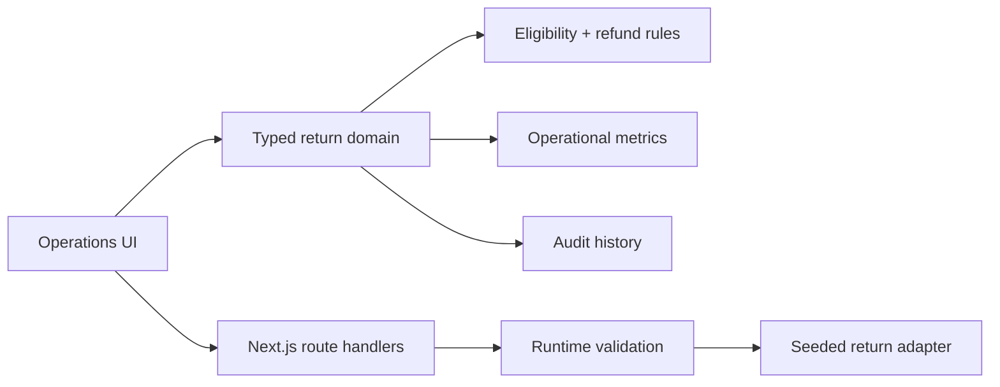

# Returns Control Center

[](https://github.com/soufianeelseflo/returns-control-center/actions/workflows/ci.yml)


**A post-purchase operations case study for returns, refunds, RMA policy, warehouse disposition and auditability.**

Most commerce demos stop at checkout. This project focuses on what happens after the sale: deciding whether a return is eligible, understanding refund exposure, separating routine cases from risky ones, recovering inventory and leaving enough context for another operator to understand what happened.

> **Scope note:** all commerce data is fictional and seeded for public review. This repository demonstrates the product architecture and operational workflows; it is not presented as client work or production traffic.

## Review path

| Surface | What to look for |
| --- | --- |
| `/` | Operational KPIs, RMA queue and recent audit context |
| `/operations` | Queue-oriented handling of active return cases |
| `/returns/[id]` | Case detail and actions |
| `/insights` | Risk/refund visibility |
| `/policies` | Explicit eligibility and disposition logic |
| `/api/returns` | Typed API boundary |
| `/api/returns/summary` | Operational summary endpoint |

## Architecture



The key design choice is keeping **policy and business rules outside the UI**. Screens render decisions; they do not own the rules that determine eligibility, refund amount or operational disposition.

## What this repository demonstrates

- Next.js App Router + React + strict TypeScript
- Searchable RMA queue and case-detail flows
- Explicit return eligibility rules separated from presentation
- Refund exposure and risk-based routing
- Restockability / warehouse disposition handling
- Audit trail for operational context
- Operational KPIs built from the same return domain
- Typed API routes with validation and meaningful HTTP errors
- Responsive dark operations UI
- Loading, error and not-found states
- CI that typechecks and builds the production bundle

## Engineering decisions

### Policy belongs in domain code

Eligibility and return rules live in `lib/rules.ts` rather than being duplicated across buttons and pages. That makes the behavior easier to test, reason about and replace when a real merchant has more complex policy requirements.

### Operators need context, not only status

The audit trail captures who changed a case, what happened and the note attached to the decision. This is intentionally visible in the product surface because post-purchase operations are collaborative work.

### Refund exposure is an operational metric

The overview treats open refund liability as a first-class KPI rather than only showing case counts. That is closer to how an operations or finance team evaluates return workload.

### Risk is a routing signal

High-risk cases are surfaced separately so routine RMAs can remain fast while exceptional cases get manual review.

## Production integration map

| Public case-study implementation | Production replacement |
| --- | --- |
| Seeded return records | Commerce DB / OMS / ERP |
| Static audit history | Persistent event/audit store |
| Simple risk flags | Merchant fraud/risk service |
| Demo case actions | Transactional workflow/service layer |
| Open operational routes | Authentication + RBAC |
| Local rules | Merchant-configurable policy service |

## Code map

```text
app/
├── page.tsx                  # operations overview
├── operations/               # active case handling
├── returns/[id]/             # RMA case detail
├── insights/                 # risk/refund visibility
├── policies/                 # policy explanation surface
└── api/returns/              # typed API boundary
components/
├── return-table.tsx          # reusable queue/table surface
├── case-actions.tsx          # case mutations
└── status-pill.tsx           # status presentation
lib/
├── data.ts                   # seeded public-review data
├── rules.ts                  # return/eligibility rules
├── metrics.ts                # operational calculations
└── types.ts                  # shared return domain
```

## Run locally

```bash
npm install
npm run dev
```

Quality gates:

```bash
npm run typecheck
npm run build
```

## About this repository

This is a **public engineering case study** using fictional data. The goal is to make implementation quality, product reasoning and operational trade-offs directly inspectable without relying on screenshots or unverifiable claims.

Built by **Soufiane** — React / Next.js / TypeScript product engineering, e-commerce operations, APIs and internal tooling.

See [NOTICE.md](NOTICE.md) for repository-use terms.
